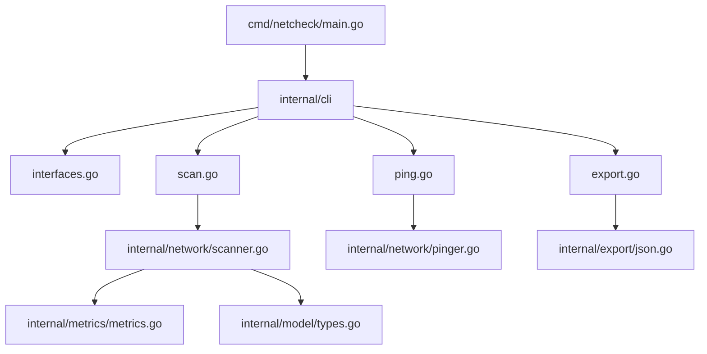

# go-network-checker


A CLI network diagnostic tool built with Go. Discover network interfaces, ping hosts, scan ports concurrently, and export results to JSON — with Prometheus metrics built in.

## Features

- **Interface discovery** — list network interfaces with IP, MAC, MTU
- **Ping** — concurrent multi-host ping with RTT and packet loss
- **Port scanning** — concurrent TCP port scanner with semaphore-controlled concurrency
- **JSON export** — save scan results to timestamped JSON files
- **Prometheus metrics** — `/metrics` endpoint on `:2112`
- **Context cancellation** — clean Ctrl+C shutdown

## Installation

```bash
git clone https://github.com/Kiryue0/go-network-checker
cd go-network-checker
make build
```

## Usage

```bash
# List network interfaces
./netcheck interfaces

# Ping one or more hosts
./netcheck ping 8.8.8.8 1.1.1.1

# Scan ports on a host
./netcheck scan 8.8.8.8 -p 80,443
./netcheck scan 8.8.8.8 -p 1-1000 -t 3s

# Export scan results to JSON
./netcheck export 8.8.8.8 -p 80,443 -o ./output
```

## Makefile

```bash
make build   # compile binary
make test    # run tests with race detector
make run     # run without compiling
make clean   # remove binary
```

## Prometheus Metrics

Start a scan, then query metrics at `http://localhost:2112/metrics`:

| Metric | Type | Description |
|--------|------|-------------|
| `scan_ports_total` | Counter | Total ports scanned |
| `scan_ports_open_total` | Counter | Open ports found |
| `scan_errors_total` | Counter | Network errors (not connection refused) |
| `scan_duration_seconds` | Histogram | Port scan duration |
| `export_errors_total` | Counter | JSON export errors |

## Architecture



## Project Structure

```
go-network-checker/
├── cmd/netcheck/        # entry point
├── internal/
│   ├── cli/             # cobra commands
│   ├── network/         # scanner, pinger
│   ├── export/          # JSON writer
│   ├── metrics/         # Prometheus metrics
│   └── model/           # data types
├── output/              # JSON export directory
├── Makefile
└── README.md
```

## Tech Stack

- **Go 1.21+**
- [Cobra](https://github.com/spf13/cobra) — CLI framework
- [prometheus/client_golang](https://github.com/prometheus/client_golang) — metrics
- `log/slog` — structured logging
- `sync.WaitGroup` + buffered channels + semaphore pattern — concurrency